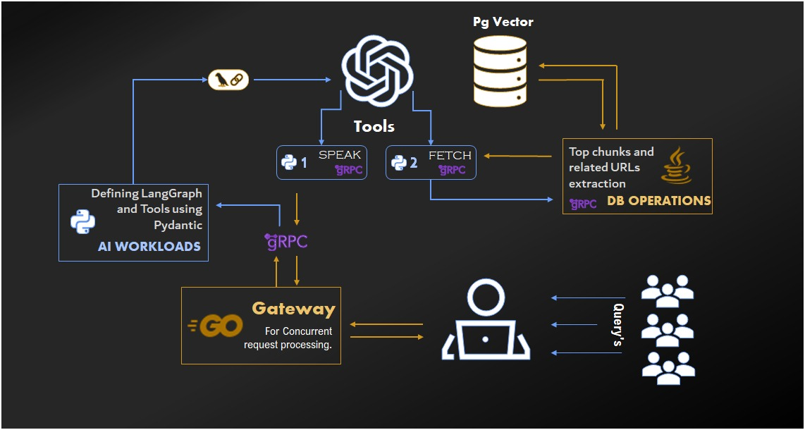

<div align="center">

<br/>


 █████╗ ██████╗ ██╗    ███████╗██╗   ██╗███╗   ██╗██╗ ██████╗
██╔══██╗██╔══██╗██║    ██╔════╝╚██╗ ██╔╝████╗  ██║██║██╔═══██╗
███████║██████╔╝██║    ███████╗ ╚████╔╝ ██╔██╗ ██║██║██║   ██║
██╔══██║██╔═══╝ ██║    ╚════██║  ╚██╔╝  ██║╚██╗██║██║██║▄▄ ██║
██║  ██║██║     ██║    ███████║   ██║   ██║ ╚████║██║╚██████╔╝
╚═╝  ╚═╝╚═╝     ╚═╝    ╚══════╝   ╚═╝   ╚═╝  ╚═══╝╚═╝ ╚══▀▀═╝


### *Talk to your APIs. Stop filling forms.*

<br/>

[](https://opensource.org/licenses/MIT)


<br/>

</div>

---

## What is ApiSynIQ?

**ApiSynIQ** is an open-source framework that lets users interact with your APIs through **natural voice or text** — no more long frontend forms, no more manual JSON wrangling.

Just say *"Book me a ticket to Mumbai for tomorrow"* or type *"Update my shipping address to..."* — ApiSynIQ understands the intent, constructs the correct request payload, calls the right endpoint, and hands back a human-readable response.

> **TL;DR** — It's a conversational layer that sits in front of your APIs and makes them accessible to anyone, through any interface.

<br/>

### What it does for you

| Without ApiSynIQ | With ApiSynIQ |
|---|---|
| User fills a 10-field form | User says what they want |
| Developer wires up every UI field | ApiSynIQ infers params from intent |
| Static, brittle API calls | Semantic search finds the right endpoint |
| Voice? That's a separate project | Voice ↔ Text built in |

<br/>

---

## Architecture



A user query travels through four purpose-built layers, each chosen for what it does best.

<br/>

### 1 · GO Gateway — *Handle Everything, Drop Nothing*

Every request — voice or text, HTTP or WebSocket — lands here first.

Go was chosen deliberately: its goroutine model makes concurrent request handling nearly effortless, and it shines at being the reliable front door for high-throughput workloads.

- **`net/http`** — handles all standard HTTP requests with zero overhead
- **`gorilla/websocket`** — maintains persistent, streaming WebSocket connections so AI tokens flow to the client in real time, as they're generated

Once a request is accepted, it's dispatched to the AI Orchestrator over gRPC.

<br/>

### 2 · AI Orchestrator — *The Brain*

Written in Python, because when it comes to AI tooling, nothing else comes close. This is where all the intelligence lives.

**Core responsibilities:**

- Route user requests to the right AI model
- Reason about which API endpoint best satisfies the user's intent
- Pull relevant context and feed it to the model
- Persist conversation history to the database
- Manage LangChain and LangGraph agent logic
- Define tools and wire them to deep agents and subagents
- Transcribe voice → text and synthesize text → voice
- Convert raw JSON schemas into Pydantic models for clean, typed API definitions

**How it queries the API catalogue:**

The orchestrator communicates with the API Resolver via two query types:

| Query Type | When it's used | Typical endpoints |
|---|---|---|
| **Input Query** | The API expects a request body | `POST`, `PUT`, `PATCH` |
| **Output Query** | The API returns data to interpret | `GET`, `DELETE` |

<br/>

### 3 · API Resolver — *The Memory*

Written in Java, which brings a mature, battle-tested ecosystem for database-heavy workloads.

This service is the RAG engine of ApiSynIQ. It stores every API's input and output descriptions as vector embeddings in **pgvector** (PostgreSQL), and when the orchestrator needs to find the right endpoint, it runs a semantic similarity search — not a brittle keyword lookup, but genuine meaning-based retrieval.

**Beyond RAG, it also handles:**

- Maintaining relational mappings between API parameters and their natural language descriptions
- Storing structured information about every JSON schema an API accepts
- Powering all CRUD operations for the SDK
- Serving as the backend for SDK updates triggered through the UI

<br/>

### 4 · Java Agent SDK — *The Connector*

The Java Agent is an annotation-based SDK that lets you describe your API endpoints, DTOs, and parameters in plain language — right inside your existing Java code. No separate config files, no external schema management. Just annotate, and ApiSynIQ knows everything it needs to route, fill, and call your APIs intelligently.

> Currently available for Java. Support for more languages is on the roadmap.

**Annotations at a glance:**

| Annotation | Placed On | Purpose | Parameters |
|---|---|---|---|
| `@AIExposeController` | Controller class | Gives ApiSynIQ a complete picture of all endpoints in the class — what they collectively do and why they exist | `name`, `description` |
| `@AIExposeDto` | DTO / request body class | Describes a Data Transfer Object so the AI knows what it's filling — whether it's a request body, input param, or nested object | `name`, `description`, `example` |
| `@AIExposeEpHttp` | Individual endpoint method | The richest annotation — fully describes an endpoint: what it does, how to call it, when to use it, and what it returns. Powers the semantic search in the API Resolver | `name`, `tags`, `example`, `pathParameters`, `requestParameters`, `headers`, `variables`, `autoExecute`, `inputDescription`, `returnDescription` |
| `@Describe` | Any variable or parameter | A versatile, fine-grained annotation for documenting individual fields — DTO variables, query params, path params, and more | `name`, `description`, `dataType`, `defaultValue`, `options`, `autoExecute`, `example` |

**Why annotations?**

Keeping descriptions co-located with code means they stay in sync as your APIs evolve. No drift between docs and reality. When a field changes, the annotation changes with it — and ApiSynIQ's understanding updates automatically.

<br/>

---

## Request Flow — End to End

```
Users (voice / text)
        │
        ▼
  [ GO Gateway ]  ←── concurrent HTTP + WebSocket handling
        │  gRPC
        ▼
[ AI Orchestrator ]  ←── LangGraph agents, tool definitions, voice I/O
        │                        │
        │  gRPC (FETCH)          │  gRPC (SPEAK)
        ▼                        ▼
 [ API Resolver ]         [ TTS / Response ]
 pgvector RAG search
 Top chunks + URLs
        │
        ▼
  Correct API called → Response interpreted → User gets an answer
```

<br/>

---

## Tech Stack

| Layer | Language | Key Libraries |
|---|---|---|
| Gateway | Go | `net/http`, `gorilla/websocket` |
| AI Orchestrator | Python | LangChain, LangGraph, Pydantic, gRPC |
| API Resolver | Java | Spring, pgvector, gRPC |
| Java Agent SDK | Java | Custom annotations |
| Vector Store | PostgreSQL | pgvector extension |
| Transport | gRPC | Protobuf |

<br/>

---

## Getting Started

> **Documentation and quickstart guides are coming soon.**
> Watch this repo to be notified when they drop.

In the meantime, feel free to explore the architecture, open issues with questions, or contribute ideas in the Discussions tab.

<br/>

---

## Contributing

ApiSynIQ is open source and contributions are very welcome. Whether it's a bug fix, a new tool integration, or an improvement to the RAG pipeline — open a PR and let's build this together.

<br/>

---

## License

[MIT](LICENSE) — free to use, modify, and distribute.

<br/>

<div align="center">

*Built for developers who believe APIs should talk back.*

</div>
